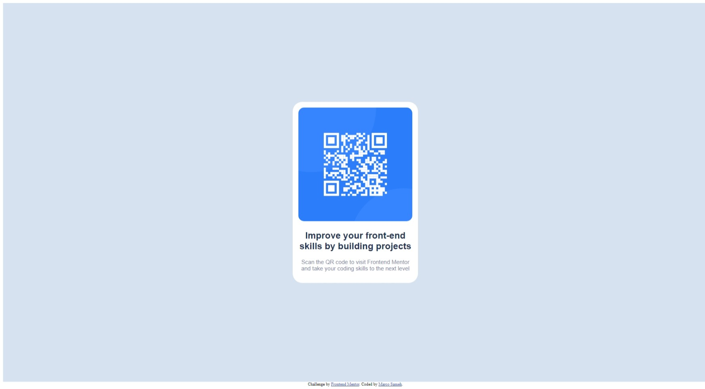

# Frontend Mentor - QR code component solution

This is a solution to the [QR code component challenge on Frontend Mentor](https://www.frontendmentor.io/challenges/qr-code-component-iux_sIO_H). Frontend Mentor challenges help you improve your coding skills by building realistic projects. 

## Table of contents

- [Overview](#overview)
  - [Screenshot](#screenshot)
  - [Links](#links)
- [My process](#my-process)
  - [Built with](#built-with)
  - [What I learned](#what-i-learned)
  - [Continued development](#continued-development)
- [Author](#author)

## Overview

### Screenshot



### Links

- Solution URL: [Add solution URL here](https://your-solution-url.com)
- Live Site URL: [Add live site URL here](https://your-live-site-url.com)

## My process

### Built with

- Semantic HTML5 markup
- CSS custom properties
- Flexbox

### What I learned

- Making the structure of the site using HTML.
- Creating Flex Box to organize the layout. 
- Styling them with CSS using external file.

Here are some codes I learnt:

```html
<h2>Improve your front-end skills by building projects</h2>
```
```css
.container {
  display: flex;
}
```

### Continued development

- Learning more about HTML and CSS
- Mastering FlexBox and Grid

## Author

- Frontend Mentor - [@Marco64-bit](https://www.frontendmentor.io/profile/Marco64-bit)
- Twitter - [@MarcoSameh17](https://twitter.com/MarcoSameh17)
